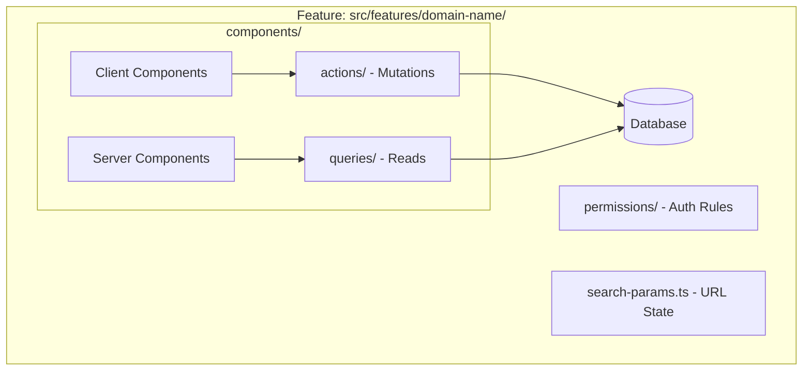

# Shared Architecture & Coding Conventions Template

This document provides a clean, self-contained template defining the architectural guidelines, directory structures, and coding conventions for modern Next.js applications. It is adapted from the core conventions of this codebase so you can easily copy and paste it into new or existing repositories (e.g., as `GEMINI.md` or `docs/ARCHITECTURE.md`).

---

## 🛠️ Core Agent & Development Mandates

1. **Architectural Adherence**: All Next.js/React code must strictly follow the **Feature-Sliced Architecture**. Pages must remain extremely thin, generic components must be domain-agnostic, and feature-specific business logic must be fully self-contained inside `src/features/`.
2. **Script Reusability**: Do not write new one-off scripts for data manipulation or diagnostics without checking existing utilities first. Keep tools generic and store them under a utility folder (e.g., `scripts/utils/`).
3. **Prefixing/Proxying Commands**: If the environment uses developer/token-saving CLI proxies (such as `rtk`), prefix commands accordingly (e.g., `rtk npm run test`).
4. **Context Routing**: Reference agent memory paths (such as `.agent/memory/`) for ongoing tasks and documentation folders (such as `docs/`) for domain definitions.

---

## 📁 Directory Structure (The Blueprint)

Ensure your codebase aligns with the following division of concerns:

*   **`src/app/`**: Handles routing exclusively. Pages and layouts must be extremely thin, serving only as layout orchestrators and React `Suspense` boundaries. Use App Router route groups (e.g., `(authenticated)/`, `(public)/`) to organize middleware, layouts, and access control cleanly.
*   **`src/components/`**: Contains purely generic, highly reusable UI primitives (e.g., `form/`, `pagination/`, `ui/`, `theme/`). These components **must not** contain any domain-specific business logic.
*   **`src/features/`**: The core domain engine of the application. Contains discrete, self-contained directories for each business domain (e.g., `billing`, `auth`, `users`, `analytics`).
*   **`scripts/`**: Houses utility scripts, migration tools, database seeds, and developer workflows.
*   **`docs/`**: Stores architecture decision records (ADRs), system diagrams, design tokens, and project roadmaps.

---

## 🧠 Feature Handling (Inside `src/features/[name]/`)

Every domain folder under `src/features/` is self-contained and structured into distinct layers. Code must not leak across layers:

1.  **`actions/`**: Next.js Server Actions (e.g., `upsert-item.ts`, `delete-item.ts`).
    *   Validate inputs using schemas (e.g., Zod).
    *   Execute mutations (e.g., via Prisma, Drizzle, or external APIs).
    *   Enforce authorization and permission checks.
    *   Return a standardized status/result envelope to the UI (e.g., `{ success: boolean, error?: string, data?: T }`).
2.  **`queries/`**: Purely server-side data-fetching logic (e.g., `get-items.ts`).
    *   Perform database reads, filtering, and pagination.
    *   Apply role-based visibility checks.
    *   *Constraint:* Do not mix UI logic or data mutation code into queries.
3.  **`components/`**: Feature-specific user interface.
    *   **Server Components** (e.g., `item-list.tsx`) fetch data directly by calling functions from the feature's `queries/` layer.
    *   **Client Components** (e.g., `item-form.tsx`) handle interactive state, transitions, and submit data to the feature's `actions/` layer.
4.  **`search-params.ts`**: Handles URL state parsing and synchronization (e.g., using libraries like `nuqs` or native search parameter parsing). This separates table filtering, pagination, and active tabs from component state.
5.  **`permissions/`**: Houses isolated, unit-testable authorization utilities defining access rules for the specific feature.

---

## 🏷️ Naming & Code Style Conventions

Strict adherence to naming rules prevents visual clutter and maintains a uniform structure:

*   **Files**: Use `kebab-case.ts` (or `.tsx`) strictly. Filenames must reflect the main export (e.g., `booking-form.tsx`, `get-booking.ts`).
*   **Functions**: Use `camelCase` for queries, actions, helper functions, and utilities (e.g., `getBookings`, `createBooking`, `formatCurrency`).
*   **Components**: Use `PascalCase`.
    *   Export components as **named exports** matching the filename minus dashes (e.g., `export const BookingList = ...` inside `booking-list.tsx`).
    *   *Constraint:* Default exports are strictly reserved for App Router routing files (`page.tsx`, `layout.tsx`, `loading.tsx`, `error.tsx`).

---

## 🔄 Refactoring & Migration Strategy

When adapting legacy pages or adding to existing projects:
1.  **Extract API Routes**: Migrate data fetching/mutating out of `app/api/` routes and into structured `src/features/[name]/queries/` and `src/features/[name]/actions/`.
2.  **Context Decoupling**: Deconstruct bloated global contexts into feature-specific hooks or delegate state management to URL search parameters.
